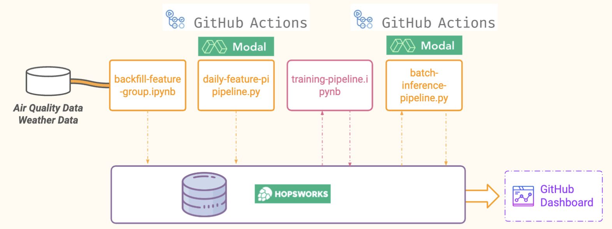

# air-quality-prediction-service

The following project aims to predict air quality (PM2.5 levels) using machine learning models. The project involves several steps, including data collection, feature engineering, model training, batch inference, and monitoring. The pipeline ensures that the predictions are continuously updated and monitored for accuracy.



## Link

All the visualizations can be found at [Air Quality Prediction Service](https://martinebravo.github.io/air-quality-prediction-service/)

## Initialization

First, let's create the virtual environment:

```bash
conda env create -n AirQuality 
conda activate AirQuality
```

Then, let's install the dependencies:

```bash
pip install -r requirements.txt
```

## Project Structure

```
air_quality_model/
    images/
    model.json # XGBoost model
    model.pkl # Scikit-learn model
data/
    stockholm-st-eriksgatan-83-air-quality.csv
docs/
    _includes/
        air_quality.html
    air-quality/
        assets/
            img/
    index.html
    info/
public/
README.md
requirements.txt
util.py
1-backfill-feature-group.ipynb
2-daily-feature-pipeline.ipynb
3-training-pipeline.ipynb
4-batch-inference-pipeline.ipynb
```

## Notebooks

### 1. Backfill Feature Group

This notebook is responsible for backfilling the feature group with historical data.

### 2. Daily Feature Pipeline

This notebook runs daily to update the feature group with the latest data.

### 3. Training Pipeline

This notebook trains the machine learning models using the data from the feature group.

### 4. Batch Inference Pipeline

This notebook performs batch inference using the trained models to predict air quality.

## Environment Variables

The project uses environment variables stored in a 

.env

 file. Make sure to create this file with the necessary variables:

```
HOPSWORKS_API_KEY=<your_hopsworks_api_key>
AQI_API_KEY=<your_aqi_api_key>
```

## Dependencies

The project dependencies are listed in the 

requirements.txt

 file:

```
hopsworks
geopy
openmeteo_requests 
requests_cache 
retry_requests
matplotlib
python-dotenv
scikit-learn
xgboost
lightgbm
joblib
```

## References

- [Assignment Instructions](./docs/info/instructions.pdf)
- [Introduction Lecture](./docs/info/01-introduction.pdf)
- [Serverless Machine Learning Lecture](./docs/info/02-serverless-ml.pdf)
- [Building Machine Learning Systems with a Feature Store, Chapter 03](https://learning.oreilly.com/library/view/building-machine-learning/9781098165222/)
- [Conda Virtual Environment Guide - Medium](https://medium.com/@viraj1604/comprehensive-guide-conda-virtual-environment-d70fafa7cf48)

## Usage

1. **Backfill Feature Group**: Run the 

1-backfill-feature-group.ipynb

 notebook to backfill the feature group with historical data.
2. **Daily Feature Pipeline**: Schedule the 

2-daily-feature-pipeline.ipynb

 notebook to run daily to update the feature group with the latest data.
3. **Training Pipeline**: Run the 

3-training-pipeline.ipynb

 notebook to train the machine learning models.
4. **Batch Inference Pipeline**: Run the 

4-batch-inference-pipeline.ipynb

 notebook to perform batch inference and predict air quality.

## License

This project is licensed under the MIT License. See the LICENSE file for details.